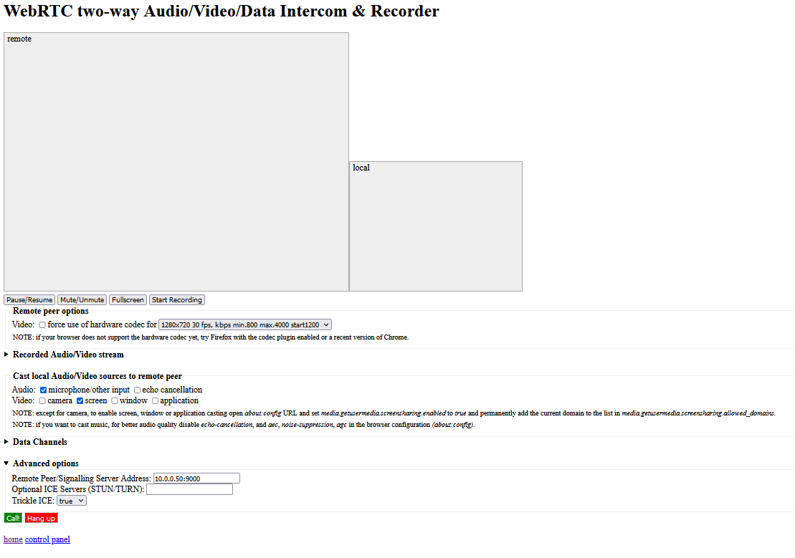

# [UV4L Firefox-PC Screen Share to Pi](https://www.linux-projects.org/uv4l/tutorials/screen-mirroring/)
### Installing UV4L Packages on Pi
If UV4L Streaming Server isn't yet installed on Raspberry Pi, install necessary packages:
 ```bash
pi@raspberrypi:~ $ sudo apt-get update
pi@raspberrypi:~ $ sudo apt-get install uv4l, uv4l-dummy, uv4l-server, uv4l-webrtc
 ```

### Generate UV4L HTTPS SSL Private Key & Certificate on Pi
If you haven't generated the SSL key & cert on your Pi, generate them:

```bash
pi@raspberrypi:~ $ sudo bash -c "openssl genrsa -out /etc/ssl/private/selfsign.key 2048 && openssl req -new -x509 -key /etc/ssl/private/selfsign.key -out /etc/ssl/private/selfsign.crt -sha256"
```

### Configure Firefox Screen Sharing on PC
Open Firefox on your PC or laptop, type `about:config` in the address bar and press enter. In the Search field, type `media.getusermedia.screensharing.enabled` and toggle its value to true with a double-click. Now search for `media.getusermedia.screensharing.allowed_domains` and add your Raspberry Pi hostname or IP address or domain name to the list in the string (e.g. 192.168.1.2)

### Launch UV4L Instance on Pi
```bash
pi@raspberrypi:~ $ uv4l --driver dummy --auto-video_nr --enable-server \
		--server-option '--use-ssl=yes' \
		--server-option '--ssl-private-key-file=/etc/ssl/private/selfsign.key' \
		--server-option '--ssl-certificate-file=/etc/ssl/private/selfsign.crt' \
		--server-option '--enable-webrtc-video=no' \
		--server-option '--enable-webrtc-audio=no' \
		--server-option '--webrtc-receive-video=yes' \
		--server-option '--webrtc-receive-audio=yes' \
		--server-option '--webrtc-renderer-source-size=yes' \
		--server-option '--webrtc-renderer-fullscreen=yes' \
		--server-option '--webrtc-receive-datachannels=no' \
		--server-option '--port=9000'
```

### Visit Pi Streaming Server and Share Screen
On your PC in Firefox, visit `https://raspberrypi:9000/stream/webrtc` where `raspberrypi` is host-name or IP of your Pi \
Under `Cast local Audio/Video sources to remote peer`, choose appropriate settings. Then, click the green `Call!` button to begin sharing \


### [Kernel Panics](https://medium.com/home-wireless/headless-streaming-video-with-the-raspberry-pi-zero-w-and-raspberry-pi-camera-38bef1968e1)
There are two reasons for kernel panics (complete failures). First, if you do full resolution video you must allocate more memory to the GPU. This is done in the `/boot/config.txt` file as a setting for `gpu_mem`. \
\
`gpu_mem=256` \
\
is what I ended up using. It’s pretty tight on CPU RAM but worked ok for me. At the usual `gpu_mem` setting of `128` I wasn’t able to get full-resolution images but lower resolutions worked fine. \
\
The second reason is more insidious. I found that my camera would only run for a while and then at full resolution it would overheat. The combination of constantly running the Wi-Fi and the camera port cause chips to heat up and in the sealed camera enclosure it overheats and you get a Kernel Panic and complete fail. You can run at lower resolution and cut the frame rate — or take the top off. What I did was watch CPU usage. \
\
A much better solution is to use `h264`. I was forced to use MJPG for streaming in my application and I assume (but didn’t check) that `mjpg-streamer` also uses it. If you can receive `H.264` it’s much lower resource usage on the Wi-Fi and probably on the GPU as well. \

#### Helpful Commands
Show the current chip temperature (`vcgencmd is in /opt/vc/bin`): \
\
`vcgencmd measure_temp`
\
Show CPU usage: \
\
This requires `systat` for a simple rolling cpu usage view. \
\
`sudo apt-get install sysstat` \
`sar -u 2 # every two seconds show usage`
