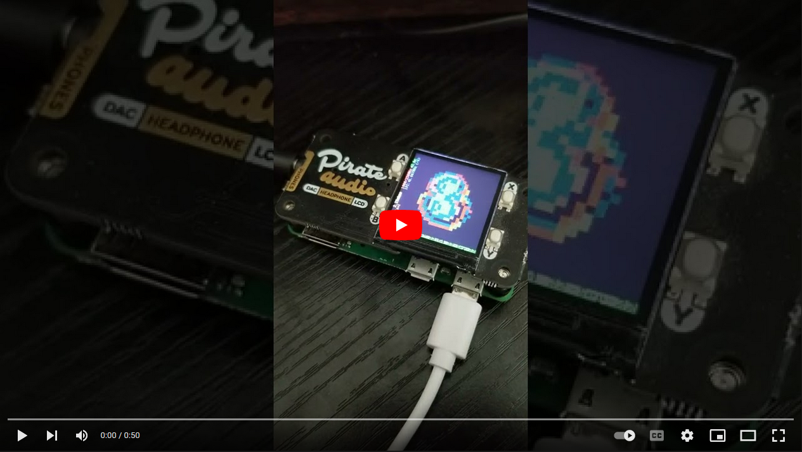

## Raspberry Pi Zero W Wifi Client, Audio Server, LCD Display, Lorenz Audio Visualization

<p align="center">
    <a href="https://www.youtube.com/watch?v=rCKuR259FjY"></a>
</p>


This is my Raspberry Pi Zero W with a Pirate Audio hat on it, which has a ST7789 240x240 LCD display and an audio jack. The display is being driven by the very cool [juj/fbcp-ili9341](https://github.com/juj/fbcp-ili9341). I've got Raspberry Pi OS Lite booting to `/dev/tty1`, which `~/.bashrc` checks, then spawns and attaches to a `tmux` session. I can `ssh` into my Pi's own wifi network spun up via the very cool [cjimti/iotwifi](https://github.com/cjimti/iotwifi) Docker container ([my tweaks](<../wifi_and_WAP.md>)), attach to the session from there too, and display a shared terminal session on the Pi's LCD. The Pi can connect to an actual network, too. As a PulseAudio server, the Pi can play audio from another device on the network. The command line tool displaying the Lorenz visualization of the sine wave audio is [cli-visualizer](https://github.com/dpayne/cli-visualizer).


### [SPI-Based LCD Driver](https://github.com/juj/fbcp-ili9341)

1. Edit `/boot/config.txt` to use custom SPI driver
```
hdmi_force_hotplug=1
display_rotate=1
hdmi_group=2
hdmi_mode=87
hdmi_cvt=240 240 60 1 0 0 0
#dtparam=spi=on #disabled for lcd testing
```

2. Clone Repo
```bash
sudo apt-get install cmake
cd ~
git clone https://github.com/juj/fbcp-ili9341.git
cd fbcp-ili9341
```

3. Edit `~/fbcp-ili9341/config.h` and comment out some stuff
```
193 // If enabled, build to utilize DMA transfers to communicate with the SPI peripheral. Otherwise polling
194 // writes will be performed (possibly with interrupts, if using kernel side driver module)
195 // #define USE_DMA_TRANSFERS
196
197 // If defined, enables code to manage the backlight.
198 // #define BACKLIGHT_CONTROL
199
200 // #if defined(BACKLIGHT_CONTROL)
201
202 // If enabled, reads keyboard for input events to detect when the system has gone inactive and backlight
203 // can be turned off
204 // #define BACKLIGHT_CONTROL_FROM_KEYBOARD
205
206 // This device file is used to capture keyboard input. This may be "/dev/input/event0" or something else
207 // on some Pis
208 // #define KEYBOARD_INPUT_FILE "/dev/input/event1"
209
210 // If enabled, the display backlight will be turned off after this many usecs of no activity on screen.
211 // #define TURN_DISPLAY_OFF_AFTER_USECS_OF_INACTIVITY (1 * 60 * 1000000)
212
213 // #endif
```

4. Build 
```bash
mkdir build
cd build
cmake -DPIRATE_AUDIO_ST7789_HAT=ON -DSPI_BUS_CLOCK_DIVISOR=6 -DSTATISTICS=0 ..
make -j
```

5. Run LCD driver process: `$ sudo ./fbcp-ili9341/build/fbcp-ili9341`

### Run LCD driver process on boot

6. Via `crontab -e`, add below command for driving LCD on boot
```bash
@reboot sudo /home/john/fbcp-ili9341/build/fbcp-ili9341 &
```

### RPi OS Lite - Launch TMUX Session & Display on LCD on boot

7. Edit `~/.bashrc` to launch and attach to a TMUX session from `/dev/tty1` by adding below contents

```bash
if [[ $(tty) == "/dev/tty1" ]]; then
  tmux new-session -d -s tmuxsesh -c ~
  tmux a -t tmuxsesh
fi
if [[ $(tty) == "/dev/pts/0" ]]; then
  PS1="$ "
fi
```

8. Add `logo.nologo` to end of first line in `/boot/cmdline.txt` to remove Raspberry Pi logo splash from boot

9. ssh to raspberry pi. Attach to the shared session: `$ tmux a -t tmuxsesh`.
10. Check the current tmux sessions: `$ tmux list-clients`
```
/dev/tty1: tmuxsesh [30x30 linux] (utf8)
/dev/pts/1: tmuxsesh [133x30 linux] (utf8)
```
11. You may want to resize your TMUX terminal to the size of tty1's on the tiny LCD: `<control-b> : resize-window -a`

### Pirate Audio - Sound out Aux jack

12. Add below to `/boot/config.txt`
```
dtoverlay=hifiberry-dac
gpio=25=op,dh
# dtparam=audio=on
dtparam=audio=off
```

#### Nice audio for good vis
```bash
speaker-test -c 1 -t sine
```

### PulseAudio Pi Server & Remote Client

13. Start the PulseAudio TCP server & client modules
```bash
# Pi  server (on LAN here)
pactl load-module module-native-protocol-tcp auth-ip-acl="127.0.0.0/8;10.0.0.0/8;172.16.0.0/12;192.168.0.0/16;fe80::/10"
pactl load-module module-zeroconf-publish
```
```bash
# client
pactl load-module module-zeroconf-discover
```
