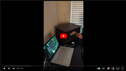

## Watching Videos on a 1" Raspberry Pi Zero W LCD Display

<p align="center">
   <a href="https://www.youtube.com/watch?v=Z2iemmzBF1A"></a>
</p>

This is my Raspberry Pi Zero W with a Pirate Audio hat on it, which has a ST7789 240x240 LCD display and an audio jack. The display is being driven by the very cool [juj/fbcp-ili9341](https://github.com/juj/fbcp-ili9341). I've got Raspberry Pi OS Lite booting to `/dev/tty1`, which `~/.bashrc` checks, then spawns and attaches to a `tmux` session. I can `ssh` into my Pi's own wifi network spun up via the very cool [cjimti/iotwifi](https://github.com/cjimti/iotwifi) Docker container ([my tweaks](<./wifi_and_WAP.md>)), attach to the session from there too, and display a shared terminal session on the Pi's LCD. The Pi can connect to an actual network, too. \
For more info about how that works, see [my last project](./fbcp-ili9341-SPI-Display-Pirate-Audio.md), which I'm building off for this one.

### [Teletypes, Pseudo-Terminal Slaves, & X Window System](https://unix.stackexchange.com/a/336527)
My Pi has no Desktop Environment Graphical User Interface (GUI). It's got no mouse or keyboard either. It does have a hardware display: the 1" LCD.

On Linux, you've got a few instances of Teletypes (`tty`s). In short, a `tty` is a text input/output environment. A `tty` is a console: a hardware display-screen, hardware keyboard, & software command-line-interface/shell to interact with the kernel (the interface to control the hardware) via issuance of typed out commands which the kernel executes and then writes any relevant output or errors to the display. On 1 computer with 1 kernel, 1 keyboard, & 1 display, you can have multiple `tty`s which you can switch between. On a typical desktop computer which has a Linux distribution installed, one of the `tty`s runs a command to launch a process to spawn the familar GUI desktop environment with your wallpaper, mouse-pointer/cursor, files, etc, and the actual `tty` command-line-interface/shell under it all is never seen.

A Pseudo-Terminal Slave (`pts`) is like a `tty` but without the physical display & keyboard hardware. I'll be using a `pts` on the Pi from a remote device via the secure shell protocol (`ssh`).\
Also, I'll have a `tty` on the Pi spawn a `tmux` terminal mutliplexer session w/ a `pts` that both my Pi and I can share and because a `tty` spawned it, I can see it live on Pi's hardware display.

Most machines have adequate hardware resources to host an [X server](https://en.wikipedia.org/wiki/X_Window_System) to display a Graphical User Interface (GUI). An X server is software that "provides display and I/O services to applications \[(clients)\]." The Pi's hardware resources become pretty burdened by graphical applications. This is a limitation that is interesting to work around.

### Just Show me the IP - General Purpose Input/Output (GPIO), Pulse-Width Modulation (PWM), & Dutytime
It'd be nice if I could just push a button.\
The Pirate Audio circuit board w/ the LCD sits on 40 General-Purpose Input/Output (GPIO) software controlled digital signal pins I soldered to my Pi.
```
$ pinout
.-------------------------.
| oooooooooooooooooooo J8 |
| 1ooooooooooooooooooo   |c
---+       +---+ PiZero W|s
 sd|       |SoC|   V1.1  |i
---+|hdmi| +---+  usb pwr |
`---|    |--------| |-| |-'

Revision           : 9000c1
SoC                : BCM2835
RAM                : 512MB
Storage            : MicroSD
USB ports          : 1 (of which 0 USB3)
Ethernet ports     : 0 (0Mbps max. speed)
Wi-fi              : True
Bluetooth          : True
Camera ports (CSI) : 1
Display ports (DSI): 0

J8:
   3V3  (1) (2)  5V
 GPIO2  (3) (4)  5V
 GPIO3  (5) (6)  GND
 GPIO4  (7) (8)  GPIO14
   GND  (9) (10) GPIO15
GPIO17 (11) (12) GPIO18
GPIO27 (13) (14) GND
GPIO22 (15) (16) GPIO23
   3V3 (17) (18) GPIO24
GPIO10 (19) (20) GND
 GPIO9 (21) (22) GPIO25
GPIO11 (23) (24) GPIO8
   GND (25) (26) GPIO7
 GPIO0 (27) (28) GPIO1
 GPIO5 (29) (30) GND
 GPIO6 (31) (32) GPIO12
GPIO13 (33) (34) GND
GPIO19 (35) (36) GPIO16
GPIO26 (37) (38) GPIO20
   GND (39) (40) GPIO21
```

For the software to control the pins' digital signals, the Python library [RPi.GPIO](https://pypi.org/project/RPi.GPIO/) can be used.\
Referring to the [Pirate Audio circuit board's lineout](https://pinout.xyz/pinout/pirate_audio_line_out#), software on the Pi can listen for input signal on 4 pins mapped to the 4 buttons on the hat, so that processes can programmatically execute when buttons are pressed. Also, the LCD's backlight is controlled by a [Pulse-Width Moduled (PWM)](https://en.wikipedia.org/wiki/Pulse-width_modulation) digital signal output through pin 13, which software on the Pi can manipulate to change the screen's brightness.\
A nice feature is to have the Pi display its IP addresses on screen at the push of a button, so that I don't have to [nmap](https://nmap.org/book/toc.html) scan a network's whole IP address range to find it, so that I can `ssh` into it from another device.\
Since I have `tty1` spawn a `tmux` session on the display at boot, I want execute the `ip -br addr` command in the `tmux` session on screen so that the output is displayed. So I need to listen for digital signal input on pin 5, which will occur when button 'A' is pressed, then run the `ip -br addr` command in the `tmux` session on screen.\
Here's the Python script to do that:

```python
import signal
import os
import RPi.GPIO as GPIO


# The buttons on Pirate Audio are connected to pins 5, 6, 16 and 24
# Boards prior to 23 January 2020 used 5, 6, 16 and 20
# try changing 24 to 20 if your Y button doesn't work.
BUTTONS = [5, 6, 16, 24]

# These correspond to buttons A, B, X and Y respectively
LABELS = ['A', 'B', 'X', 'Y']

# Set up RPi.GPIO with the "BCM" numbering scheme
GPIO.setmode(GPIO.BCM)

# Buttons connect to ground when pressed, so we should set them up
# with a "PULL UP", which weakly pulls the input signal to 3.3V.
GPIO.setup(BUTTONS, GPIO.IN, pull_up_down=GPIO.PUD_UP)

# "handle_button" will be called every time a button is pressed
# It receives one argument: the associated input pin.
def handle_button(pin):
    label = LABELS[BUTTONS.index(pin)]
    if label == 'A':  # write IP addresses to tmux session
        os.system("tmux send 'ip -br addr' ENTER;")

# Loop through out buttons and attach the "handle_button" function to each
# We're watching the "FALLING" edge (transition from 3.3V to Ground) and
# picking a generous bouncetime of 100ms to smooth out button presses.
for pin in BUTTONS:
    GPIO.add_event_detect(pin, GPIO.FALLING, handle_button, bouncetime=100)

# Finally, since button handlers don't require a "while True" loop,
# we pause the script to prevent it exiting immediately.
signal.pause()
```

And I need to have the above Python script running in the background at boot, so ...

- [pirate_audio_LCD_backlight.py](../pirate_audio_LCD_backlight.py)

...

### [Linux Framebuffer](https://www.kernel.org/doc/Documentation/fb/framebuffer.txt)
Use the kernel to write color values for each pixel to memory and display it on the LCD, ideally at 60hz/fps. \
Luckily the LCD display itself is already set up, reading pixel data from memory and showing it on the screen, courtesy of [juj/fbcp-ili9341](https://github.com/juj/fbcp-ili9341) \
Now we just have to write the right pixel data to memory and let the display driver know what to display. \
...

### Tying It All Together
...
