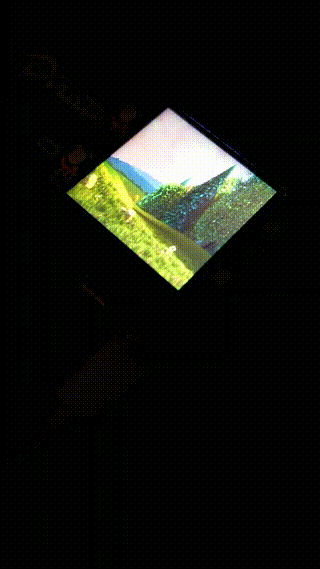

## Watching Videos on a 1 inch Raspberry Pi Zero W LCD Display

   

This is my Raspberry Pi Zero W with a Pirate Audio hat on it, which has a ST7789 240x240 LCD display and an audio jack. The display is being driven by the very cool [juj/fbcp-ili9341](https://github.com/juj/fbcp-ili9341). I've got Raspberry Pi OS Lite booting to `/dev/tty1`, which `~/.bashrc` checks, then spawns and attaches to a `tmux` session. I can `ssh` into my Pi's own wifi network spun up via the very cool [cjimti/iotwifi](https://github.com/cjimti/iotwifi) Docker container ([my tweaks](<./wifi_and_WAP.md>)), attach to the session from there too, and display a shared terminal session on the Pi's LCD. The Pi can connect to an actual network, too. \
For more info about how that works, see [my last project](./fbcp-ili9341-SPI-Display-Pirate-Audio.md), which I'm building off for this one.

### [Teletypes, Pseudo-Terminal Slaves, & X11 Displays](https://unix.stackexchange.com/a/336527)
My Pi has no Graphical User Interface (GUI) or Desktop Environment. It's got no mouse or keyboard either.
...

### Just Show me the IP; General Purpose Input/Output (GPIO), Pulse-Width Modulation (PWM), & Dutytime
It'd be nice if I could just push a button. 
- [pirate_audio_buttons.py](../pirate_audio_buttons.py)
- [pirate_audio_LCD_backlight.py](../pirate_audio_LCD_backlight.py)

...

### [Linux Framebuffer](https://www.kernel.org/doc/Documentation/fb/framebuffer.txt)
Use the kernel to write color values for each pixel to memory and display it on the LCD, ideally at 60hz/fps. \
Luckily the LCD display itself is already set up, reading pixel data from memory and showing it on the screen, courtesy of [juj/fbcp-ili9341](https://github.com/juj/fbcp-ili9341) \
Now we just have to write the right pixel data to memory and let the display driver know what to display. \
...

### Tying It All Together
...