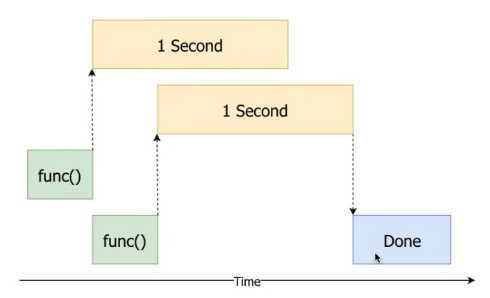

# [Python Concurrency](http://masnun.rocks/2016/10/06/async-python-the-different-forms-of-concurrency/)

__Process__: Isolated Program; it's executed with its own Segregated Memory\
__Thread__: within a Process, it's a Single Sequential Flow of Control, Logical Steps, Instructions

- CPU Bound => `Multi-Processing` (Parallel)
    - Local computation/math is slow; utilize several CPU Cores
    - Multiple Python Interpreters (for each process); high memory overhead
- I/O Bound, Max Allowed Number of Concurrent Tasks  => `Multi-Threading`
    - External task (I/O) is slow (e.g. API request) and can only have 5 concurrent tasks (TCP/IP connections); run tasks concurrently
    - 1 Python Interpreter
- I/O Bound, Very Slow I/O, Many Connections => `Asyncio`
    - External tasks (I/O) are slow and complex; requires custom fine-tuned context-switching and execution

## GIL & Multi-Threading
CPython has a [Global Interpreter Lock (GIL)](https://wiki.python.org/moin/GlobalInterpreterLock) so you can't _truly_ multi-thread (run threads simultaneously on different CPU Cores)\
Only 1 Python thread can _actually_ execute on the CPU at a time\
Though, Python multi-threading is still somewhat useful; the CPU is optimally used by threads; when 1 thread is done with computation and just waiting for I/O, another thread can utilze the CPU in the mean time.

See [concurrency.py](./concurrency.py)
