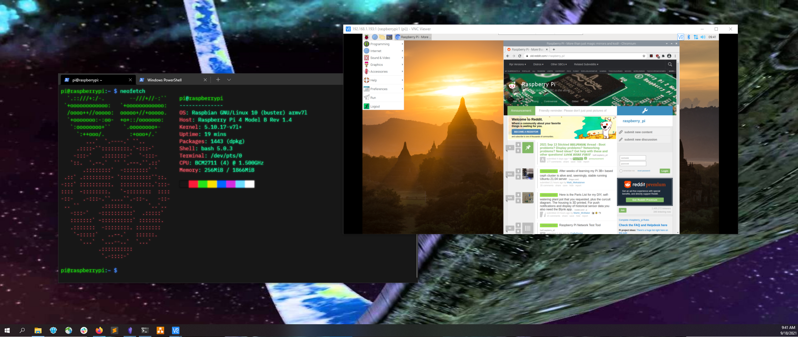

```bash
pi@raspberrypi:~ $ vncserver -depth 24 -geometry 1920x1080
VNC(R) Server 6.7.2 (r42622) ARMv6 (May 13 2020 19:34:20)
Copyright (C) 2002-2020 RealVNC Ltd.
RealVNC and VNC are trademarks of RealVNC Ltd and are protected by trademark
registrations and/or pending trademark applications in the European Union,
United States of America and other jurisdictions.
Protected by UK patent 2481870; US patent 8760366; EU patent 2652951.
See https://www.realvnc.com for information on VNC.
For third party acknowledgements see:
https://www.realvnc.com/docs/6/foss.html
OS: Raspbian GNU/Linux 10, Linux 5.10.17, armv7l

On some distributions (in particular Red Hat), you may get a better experience
by running vncserver-virtual in conjunction with the system Xorg server, rather
than the old version built-in to Xvnc. More desktop environments and
applications will likely be compatible. For more information on this alternative
implementation, please see: https://www.realvnc.com/doclink/kb-546

Running applications in /etc/vnc/xstartup

VNC Server catchphrase: "Mars frank cabaret. Orange moment Othello."
             signature: 41-d8-ed-83-7a-a1-94-b8

Log file is /home/pi/.vnc/raspberrypi:1.log
New desktop is raspberrypi:1 (192.168.1.193:1)
```

Looks like VNC is serving on Pi's port 1. \
You'll need some a VNC client to access `192.168.1.193:1` from another device. [RealVNC's works](https://www.realvnc.com/en/connect/download/viewer/)

