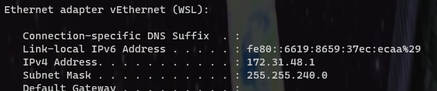
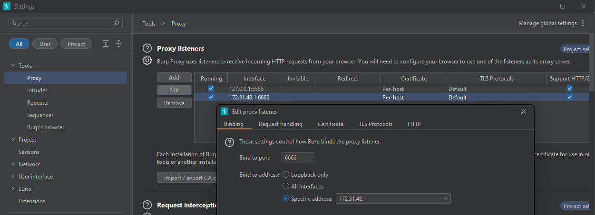

# WIP

1. Set up a BurpSuite proxy to listen on port on WSL interface
    - `PS> ipconfig` or `$ ip route`
        - 
    - 

2. Open Windows Firewall to WSL interface for inbound connections
    - `PS> Get-NetIPInterface  # look for 'vEthernet (WSL)'`
    - [PS New-NetFirewallRule Docs](https://learn.microsoft.com/en-us/powershell/module/netsecurity/new-netfirewallrule?view=windowsserver2022-ps)
    - `PS> New-NetFirewallRule -DisplayName "WSL2 to Windows" -InterfaceAlias "vEthernet (WSL)" -Direction Inbound -Protocol TCP -Action Allow`
    - `PS> Get-NetFirewallRule | Where-Object DisplayName -like "WSL2*"
